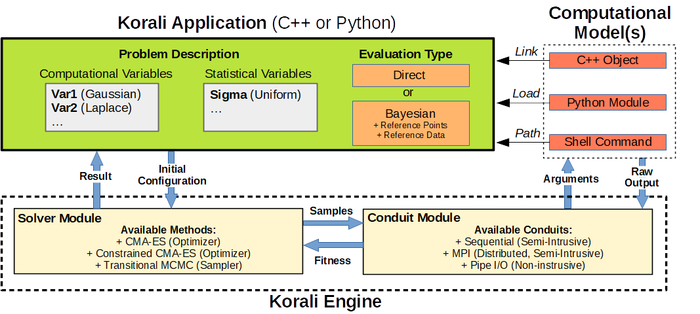

# Introduction

##Programming with Korali

Korali provides scientists with a range of optimization and uncertainty quantification tools. To use these tools, a user needs to create a *Korali Application*. This application serves as a nexus between the computational models (user-provided C++ objects, Python modules, or pre-compiled applications), and the Korali's main solver engine, as illustrated below.



To build a Korali application in Python, you need to include the corresponding korali module and declare an instance of the Korali engine:

	import korali
	k = korali.Engine()
	
The Korali Engine object encapsulates all the configuration necessary to run the Korali application. A user can configure the four key components, as described below:

+ [Problem Description](#problem-description)
+ [Solver Method](#solver-method)
+ [Evaluation Conduit](#evaluation-conduit)
+ [Computational Model](#model-interface)

## Problem Description

A Korali Problem describes the sampling space of the physical or real-world phenomenon to analyze. We describe two components of the problem description: the **variable space** and the **evaluation type**:

### Variable Space

The number of variables defined by the user represents a dimension of the problem. Variables are configured by accessing the problem's variable array, specifying their constant or variable numerical index:

```python
# Accessing variable 0
k["Problem"]["Variables"][0] 
	
# Accessing variable i
k["Problem"]["Variables"][i]
```

Korali allows defining information about each variable, such as its name and prior probability distribution, for example:

```python
k["Problem"]["Variables"][0]["Name"] = "Thermal Conductivity"
k["Problem"]["Variables"][0]["Distribution"] = "Uniform"
```

Each prior distribution defines its own set of configurable parameters. The full list of prior distribution types and their configuration can be found at:

- [Cauchy](/usage/distributions/cauchy)
- [Exponential](/usage/distributions/exponential)
- [Gamma](/usage/distributions/gamma)
- [Gaussian](/usage/distributions/gaussian)
- [Laplace](/usage/distributions/laplace)
- [Uniform](/usage/distributions/uniform)
	

We make a distinction between computational and statistical variable types. Computational variables describe the dimension of the problem-space (e.g., the X, Y, and Z coordinates of a real-world 3D problem), while statistical variables are employed to infer values from the statistical model (e.g., the error estimation $\sigma$ of a Gaussian process).

```python
k["Problem"]["Variables"][0]["Type] = "Computational"
k["Problem"]["Variables"][1]["Type] = "Statistical"
```

The number of statistical variables required depends on the evaluation type selected, as described next.
	
### Evaluation Type

During execution, the Korali engine will evaluate many *samples*. A sample represents a vector containing a particular set of values for all (computational and statistical) variables defined in the problem. Korali's engine will stochastically produce new samples to be evaluated, depending on the solver method chosen. The evaluation returns a single value, called *fitness*, per evaluated sample. The value of the sample fitness depends on the evaluation type.

The evaluation type describes the objective function to be optimized/sampled from. We distinguish between two evaluation types: 

- [Direct](/usage/evaluation/direct)
- [Bayesian](/usage/evaluation/bayesian)

