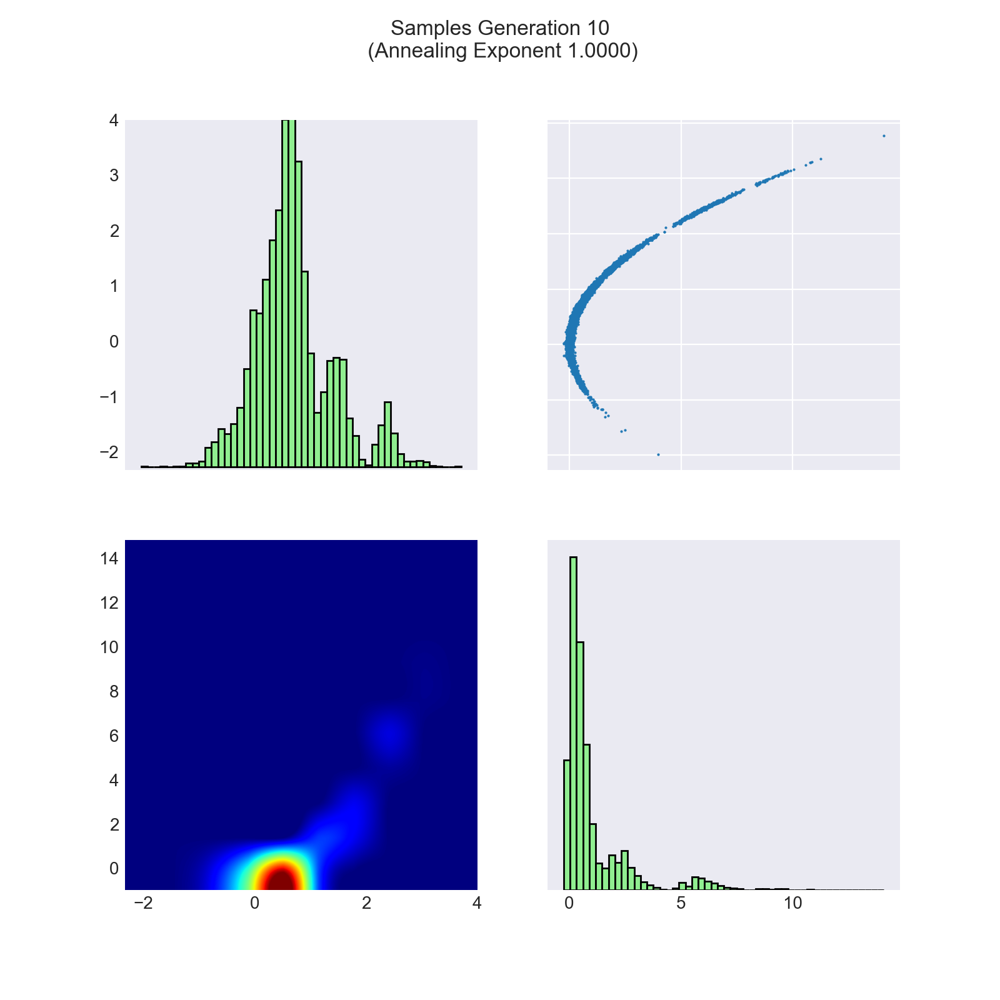

Here we explain technical details of the **TMCMC** result plot.

The `plot-korali` command plots the distribution of the samples at every
generation. The samples are read from the json-files stored in the output
directory (results folder).

A plot of the samples obtained after the final gerneration of TMCMC
function is given below. Here, the target function is the exponential of the 
negative of the 2-dimensional [Rosenbrock](https://en.wikipedia.org/wiki/Rosenbrock_function) 
function.

## Description

### Diagonal Plots
The diagonal plots show the marginal probability densities of the samples.
Note that the vertical axes correspond to the upper and lower triangle plot and
not to the diagonal plots.

### Upper Triangle
In the upper triangle we see the actual realization of the sampling from
TMCMC. The axes represent the dimensions, respectiely the objective variables,
of the problem and we show a two-dimensional plot for every variable pair.

### Lower Triangle
The lower triangle shows the probability density of the samples for each variable pair.
The density is approximated with a smoothening operator applied to the number
of samples that can be found in a given area.

