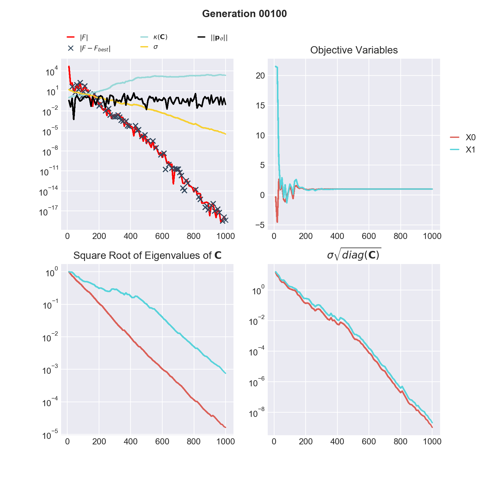

# Solvers / CMA-ES
   				   
##Description

This is the implementation of the *Covariance Matrix Adaptation Evolution Strategy*, as published in the [paper](https://doi.org/10.1007/3-540-32494-1_4) 

In an evolution strategy, new candidate solutions are sampled according to a multivariate normal distribution in $\mathbb {R} ^{n}$. Recombination amounts to selecting a new mean value for the distribution. Mutation amounts to adding a random vector, a perturbation with zero mean. Pairwise dependencies between the variables in the distribution are represented by a covariance matrix. The covariance matrix adaptation (CMA) is a method to update the covariance matrix of this distribution.

CMA-ES works iteratively, evaluating a number $\lambda$ of samples per generation, and improving the covariance matrix for the samples in the next generation.

**Requirements:**

+ The *Sample Count* per generation $\lambda$ needs to be defined.
+ The *Initial Mean* needs to be defined for every variable.
+ The *Initial Standard Deviation* needs to be defined for every variable.

##Settings

```python
  # Definition
  k["Solver"] = "CMA-ES";
  
  k["CMA-ES"]["Result Output Frequency"] = ...;
  
  # Solver Settings
  k["CMA-ES"]["Objective"] = ... 
  k["CMA-ES"]["Sample Count"] = ...
  k["CMA-ES"]["Sigma Cumulation Factor"] = ...
  k["CMA-ES"]["Damp Factor"] = ...
  k["CMA-ES"]["Max Resamplings"] = ...
  k["CMA-ES"]["Sigma Bounded"] = ...
  
  k["CMA-ES"]["Mu"]["Value"] = ...
  k["CMA-ES"]["Mu"]["Type"] = ...
  k["CMA-ES"]["Mu"]["Covariance"] = ...

  k["CMA-ES"]["Covariance Matrix"]["Cumulative Covariance"] = ...
  k["CMA-ES"]["Covariance Matrix"]["Learning Rate"] = ...
  k["CMA-ES"]["Covariance Matrix"]["Eigenvalue Evaluation Frequency"] = ...
  k["CMA-ES"]["Covariance Matrix"]["Is Diagonal"] = ...      

  # Termination Criteria
  k["CMA-ES"]["Termination Criteria"]["Max Generations"] ...
  k["CMA-ES"]["Termination Criteria"]["Max Model Evaluations"] ...
  k["CMA-ES"]["Termination Criteria"]["Min Fitness"] ...
  k["CMA-ES"]["Termination Criteria"]["Fitness Diff Threshold"] ...
  k["CMA-ES"]["Termination Criteria"]["Min DeltaX"] ...
  k["CMA-ES"]["Termination Criteria"]["Max Standard Deviation"] ...
  k["CMA-ES"]["Termination Criteria"]["Max Condition Covariance"] ...

  # Variable Settings
  k["Variables"][i]["CMA-ES"]["Lower Bound"] = ...
  k["Variables"][i]["CMA-ES"]["Upper Bound"] = ...
  k["Variables"][i]["CMA-ES"]["Initial Mean"] = ...
  k["Variables"][i]["CMA-ES"]["Initial Standard Deviation"] = ...
  k["Variables"][i]["CMA-ES"]["Minimum Standard Deviation Changes"] = ...
  k["Variables"][i]["CMA-ES"]["Log Space"] = ...
```


##Solver Settings

- **Result Output Frequency**. Specifies the output frequency of intermediate result files. By default, Korali will set this value to *1* (i.e. each generation). Example:

	```python
    # Reduce the number of result files
	k["CMA-ES"]["Result Output Frequency"] = 10

	```

- **Objective**. Specifies whether the problem evaluation is to be *minimized* or *maximized*. By default, Korali will set this value to *Maximize*. Example:

	```python
	#Maximizing problem evaluation (default)
	k["CMA-ES"]["Objective"] = "Maximize"

	#Minimizing problem evaluation
	k["CMA-ES"]["Objective"] = "Minimize"
	```
- **Sample Count**. Specifies the number of samples $\lambda$ to evaluate per each generation. Example:

	```python
	k["CMA-ES"]["Sample Count"] = 32
	```
	
- **Sigma Cumulation Factor**. Controls the learning rate of the conjugate evolution path for $\sigma$ update. By default, Korali will set this value to $\frac{\mu_{eff}+2}{\mu_{eff}+N+3}$. Example:

	```python
	k["CMA-ES"]["Sigma Cumulation Factor"] = 1.0
	```

- **Damp Factor**. Controls the update of the scaling factor $\sigma$. By default, Korali will precalibrate this value from $\mu_{eff}$ and number of variables (must be larger 0.0). Example:

	```python
	k["CMA-ES"]["Damp Factor"] = 1.0
	```	
	
- **Max Resamplings**. Number of resamplings per candidate per generation if sample is outside of Lower and Uppder Bound. By default, Korali will set this value to $10^6$. Example:

	```python
	k["CMA-ES"]["Max Resamplings"] = 10e6
	```	

- **Sigma Bounded**. Sets an upper bound for scaling factor $\sigma$. Upper bound is given by the average of the initial standard deviation of the variables. By default, Korali will set this value to *False*. Example:

	```python
	k["CMA-ES"]["Sigma Bounded"] = True
	```	
	
- **Mu Value**. Number of best samples to update the covariance matrix and the mean. By default, Korali will set this value to $\lambda / 2$. Example:

	```python
	k["CMA-ES"]["Mu"]["Value"] = 8
	```	

- **Mu Type**. Weights given to the Mu best values to update the covariance matrix and the mean. By default, Korali will set this value to *Logarithmic*. Example:

	```python
	k["CMA-ES"]["Mu"]["Value"] = "Equal"
	k["CMA-ES"]["Mu"]["Value"] = "Linear"
	k["CMA-ES"]["Mu"]["Value"] = "Logarithmic"
	```

- **Cumulative Covariance**. Controls the learning rate of the evolution path for the covariance update. By default, Korali will precalibrate this value from $\mu_{eff}$ and number of variables (must be in $(0,1]$). Example:

	```python
	k["CMA-ES"]["Covariance Matrix"]["Cumulative Covariance"] = 0.9
	```

- **Is Diag**. Tells the solver to treat the covariance matrix as diagonal matrix in order to speed up covariance matrix updates. By default, Korali will set this value to *False*. Example:

	```python
	k["CMA-ES"]["Covariance Matrix"]["Is Diag"] = True
	```


		 
## Termination Criteria

- **Max Generations** Specifies the maximum number of generations to run. By default, Korali will set this criterion as active and its value to *1000*. Example:

	```python
	k["CMA-ES"]["Termination Criteria"]["Max Generations"]["Active"] = True
	k["CMA-ES"]["Termination Criteria"]["Max Generations"]["Value"]  = 2000
	```

	
- **Max Model Evaluations** Specifies the maximum number of objective function evaluations. By default, Korali will set this criterion as inactive. Example:

	```python
	k["CMA-ES"]["Termination Criteria"]["Max Model Evaluations"]["Active"] = True
	k["CMA-ES"]["Termination Criteria"]["Max Model Evaluations"]["Value"]  = 50000
	```	
	
- **Fitness** Specifies the goal fitness to achieve before stopping execution. By default, Korali will set this criterion as inactive. Example:

	```python
	k["CMA-ES"]["Termination Criteria"]["Min Fitness"]["Active"] = True
	k["CMA-ES"]["Termination Criteria"]["Min Fitness"]["Value"]  = 0.0
	```	
	
- **Fitness Diff Threshold** Specifies the minimum fitness differential between two consecutive generations before stopping execution. By default, Korali will set this criterion as active and value $1^-9$. Example:

	```python
	k["CMA-ES"]["Termination Criteria"]["Fitness Diff Threshold"]["Active"] = True
	k["CMA-ES"]["Termination Criteria"]["Fitness Diff Threshold"]["Value"]  = 1e-12
	```	

- **Min Standard Deviation** Specifies a minimum standard deviation for the proposal distribution of the variables. Korali terminates if this value is undershot from all variables. By default, Korali will set this criterion as active and value $1^-12$. Example:

	```python
	k["CMA-ES"]["Termination Criteria"]["Min DeltaX"]["Active"] = True
	k["CMA-ES"]["Termination Criteria"]["Min DeltaX"]["Value"]  = 1e-9
	```	
	
- **Max Standard Deviation** Specifies the maximum allowed increase in the standard deviation for the proposal distribution of a variable. By default, Korali will set this criterion as active and value $1^18$. Example:

	```python
	k["CMA-ES"]["Termination Criteria"]["Max Standard Deviation"]["Active"] = True
	k["CMA-ES"]["Termination Criteria"]["Max Standard Deviation"]["Value"]  = 1e12
	```	

- **Max Condition Covariance** Specifies the maximum condition of the covariance matrix. By default, Korali will set this criterion as active and value $1^18$. Example:

	```python
	k["CMA-ES"]["Termination Criteria"]["Max Standard Deviation"]["Active"] = True
	k["CMA-ES"]["Termination Criteria"]["Max Standard Deviation"]["Value"]  = 1e12
	```	
	
## Variable Settings

- **Minimum** Specifies the lower bound for the variable's value. Korali will not generate samples in which this variable falls below the specified minimum. By default, Korali will set this value to *-Infinity*. Example:

	```python
	# Modifying the lower bound of two variables
	k["Variables"][i]["CMA-ES"][0]["Minimum"] = 0.0;
	k["Variables"][i]["CMA-ES"][1]["Minimum"] = -32.0;
	```

- **Maximum** Specifies the upper bound for the variable's value. Korali will not generate samples in which this variable falls below the specified minimum. By default, Korali will set this value to *+Infinity*. Example:

	```python
	# Modifying the upper bound of two variables
	k["Variables"][i]["CMA-ES"][0]["Maximum"] = 32.0;
	k["Variables"][i]["CMA-ES"][1]["Maximum"] = 0.0;
	```

- **Initial Mean**. Defines the initial mean for the proposal distribution. This value must be defined between the variable's *Mininum* and *Maximum* settings By default, Korali will set this value in the center of the domain. Example:

	```python
	# Modifying the initial guess mean of variable i
	k["Variables"][i]["CMA-ES"]["Initial Mean"] = 16.0;
	```

- **Initial Standard Deviation**. Defines the initial standard deviation of the proposal distribution for a variable. By default, Korali sets this value to 30% of the domain width. Example:

	```python
	# Modifying the initial standard deviation of my variable
	k["Variables"][i]["CMA-ES"]["Initial Standard Deviation"] = 2.0;
	```

- **Minimum Standard Deviation Changes**. Defines a lower bound for the standard deviation of the proposal distribution for a variable. Korali increases the scaling factor $\sigma$ if this value is undershot. By default, Korali sets this value to 0.0 (inactive). Example:

	```python
	# Modifying the initial standard deviation of my variable
	k["Variables"][i]["CMA-ES"]["Minimum Standard Deviation Changes"] = 1e-6
	```

- **Log Space**. Specifies if the log space of a variable should be searched. By default, Korali sets this value to $False$.
		
    ```python
	# Search in log space
	k["Variables"][i]["CMA-ES"]["Log Space"] = True
	```


## Plotting

Here we explain the **CMA-ES** result plot in further detail and how it can be
used to validate your optimization.

The module korali.plotter (run with `python3 -m korali.plotter` command visualizes some of the most meaningful states of CMA-ES
stored in the result files in the output directory (`_korali_result`).

In the figure below we see the evolution of the CMA-ES algorithm during 100
optimization steps, respectively 1000 function evaluations (here the sample size
is 10), of the negative 2-dimensional [Rosenbrock](https://en.wikipedia.org/wiki/Rosenbrock_function) function.



**Quadrant 1**: The first quadrant (upper left) shows 4 graphs plus markers (crosses):

* $| F |$ (red): $F$ is the best function evaluation of the current generation.
      Note that the colour of $F$ changes if $F < 0$ (red) or $F \geq 0$ (blue).
      Also, the absolute value of F is plotted since the vertical axis is given
      in log-scale.

* $\kappa(\mathbf{C})$ (cyan): This line shows the condition of the covariance matrix
	  of the proposal distribution at every generation. The condition is given
	  by the ratio of the largest Eigenvalue to the smallest Eigenvalue. A
	  large condition number may lead to numerical instabilities, this can be
	  treated by normalizing the domain of the objective variables.

* $|| \mathbf{p}_{\sigma} ||$ (black):  The evolution path is a measure of the travel
      direction of the mean of the proposal distribution of CMA-ES. The
      Euclidean norm of the evolution path plays an important rule in the Sigma
      updating rule.

* $\sigma$ (yellow) : $\sigma$ is the scaling parameter of the covariance matrix.
      The scaling parameter is updated at every generation. If Sigma becomes
	  very large or small it may have an adverse effect on the optimization.

* $| F - F_{best}|$ (crosses) : At every generation we calculate the absolute
      difference betwen the current best function evaluation ($F$) and the overall
      best found evaluation ($F_{best}$) of CMA-ES. The crosses appear only if the
      current generation does not impeove the overall result, i.e. $F < F_{best}$
      in current generation and $| F - F_{best} |$ is greater 0.

A good indicator of convergance of CMA-ES to the global maximum is given by a steady decrease of $| F - F_{best} |$.

**Quadrant 2**: Objective Variables: This plot shows the evolution of the objective variables corresponding to the
evaluation of $|F|$. A line per each dimension of the optimization problem is plotted.


**Quadrant 3**: Square Root of Eigenvalues $\mathbf{C}$: The square root of the Eigenvalues of $\mathbf{C}$ are the lengths of the axes of the (unscaled) covariance matrix. Optimally the lengths of the axes are of same magnitude.

**Quadrant 4**: $\sigma \sqrt{diag(\mathbf{C})}$: the square root of the diagonal elements of the (scaled) covariance matrix of
the proposal distribution approximate the standard deviation of the parameters. Ideally the standard deviations of all coordinates are of same magnitude.


**Example: Shekel function**

The following figure shows the results of an unsuccessful maximization of the
negative of the [Shekel](https://en.wikipedia.org/wiki/Shekel_function) function in 4
dimensions and with 10 local maxima.

[We know](http://www-optima.amp.i.kyoto-u.ac.jp/member/student/hedar/Hedar_files/TestGO_files/Page2354.htm)
that the Shekel function has a global minimum at (4, 4, 4, 4),
respectivel maximum in the negative case.
In quadrant 2 we see that CMA-ES converged to a different result.

In general the global optimum is not known, following observations indicate
ill convergence. Restarting CMA-ES from different starting points as well as
tuning CMA-ES internal parameters might improve optimization:

* Increasing condition (quadrant 1) of the covariance matrix of the proposal
  distribution, respectively diverging axes lenghts and standard deviations
  (quadrants 3 & 4).

* None decreasing values for $| F - F_{best} |$. Arguably CMA-ES found a better
  function evaluation on a different hill but the algorithm is trapped (the
  objective variables stabilized sampling does not overcome the saddle points).


