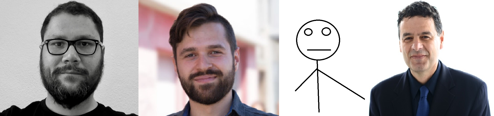

## Contact us

The Korali Project is developed and maintained by

* [**Georgios Arampatzis**](https://www.cse-lab.ethz.ch/member/georgios-arampatzis/), garampat at ethz.ch
* [**Sergio Miguel Martin**](https://www.cse-lab.ethz.ch/member/sergio-martin/), martiser at ethz.ch
* [**Daniel Waelchli**](https://www.cse-lab.ethz.ch/member/daniel-walchli/), wadaniel at ethz.ch

Director:

* [**Petros Koumoutsakos**](https://www.cse-lab.ethz.ch/member/petros-koumoutsakos/), petros at ethz.ch 

## Affiliations

  
[{: style="height:100px;"}](https://www.ethz.ch)

## Credits

Korali's code includes a properly credited and licensed copy of [Niels Lohmann's Json for C++](https://github.com/nlohmann/json).
Our implementation of CMA-ES has been inspired by [Alexander Fabisch's](https://github.com/AlexanderFabisch/CMA-ESpp) C++ implementation.
