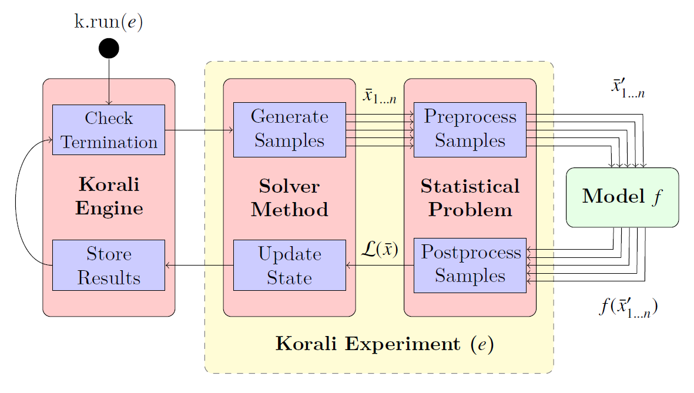

***********************
Korali Basics
***********************

This document describes the basic concepts that make a Korali application. 

Creating a Korali Experiment
========================================

Korali provides a range of optimization and uncertainty quantification tools. To use these tools, a user needs to create a *Korali Experiment*.
The following python code snippet shows how to load Korali's library and instantiate a new experiment: 

.. code-block:: python

   import korali
   e = korali.Experiment()

This creates a new experiment object which can be then configured by specifying a Korali *problem* and *solver* module combination, as shown below.

The solver method work by stochastically producing a set of samples that can be evaluated independently. The problem module pre-processes these samples based on their on their configuration and passes them to a *model* function for execution. The problem module produces post-processed results based on the results of their evaluation, which the solver module uses to produce a better estimation of the solution. We call this process a \textit{generation}, which is repeated until the solver has converged to a solution.

Experiments contain :ref:`general settings <module-experiment>` which affect the way in which Korali runs the experiment and outputs its results.    

Korali Problems
========================================

A Korali Experiment is configured to run a specific problem type by specifying its *problem type* setting, for example: 

.. code-block:: python

   # Example: Setting the experiment to run an optimization problem
   e["Problem"]["Type"] = "Optimization"

Sets the experiment to solve an :ref:`optimization <module-problem-optimization>` problem. The complete list of problem types can be found :ref:`here <module-problem>`.

Problem Configuration
---------------------------------

Each problem type has its own set of properties necessary to be fully described. These settings can be specified by using the following syntax:

.. code-block:: python

   # Example: Configuring settings 1 and 2, of string and real types, respectively. 
   e["Problem"]["Setting 1"] = "String"
   e["Problem"]["Setting 2"] = 1.0
   
Depending on the property, their values could be numeric, text strings, functions, or arrays thereof. They can also contain sub-properties which require their own set of properties, as shown below:

.. code-block:: python

   # Example: Configuring setting 3, which contains sub-properties to be defined.
   e["Problem"]["Setting 3"]["Sub-Type"] = "myType"
   e["Problem"]["Setting 3"]["Parameter 1"] = 0.0
   e["Problem"]["Setting 3"]["Parameter 2"] = 1.0

To find the full list of properties for each problem type, look for "Configuration Settings" in the problem's configuration page. Here is, for example, the :ref:`configuration settings <module-problem-optimization-config>` for Optimization/Stochastic.

Choosing a Solver Method
===================================

The next step is to choose which solver algorithm should be used to obtain the results required by the problem. This can be done by specifying the *solver type* setting. 

Solver-Problem Compatibility
---------------------------------

Although the complete list of solver types can be found :ref:`here <module-solver>`, each solver can only solve a specific set of problem types. To find which solver methods can be used for a specific problem type, look for "Compatible Solvers" in the problem's configuration page. Here is, for example, the :ref:`compatible solvers list <module-problem-optimization-compat>` for Optimization/Stochastic.  

To continue our example above, we will choose to use the :ref:`DEA <module-solver-optimizer-dea>`, which is a compatible solver for the Optimization/Stochastic problem type. 

.. code-block:: python

   k["Solver"]["Type"] = "DEA"

It is possible, however, to choose another solver to solve a given problem, simply by changing the solver method choice. For example, if now we wanted to solve the problem using :ref:`CMAES <module-solver-optimizer-cmaes>` instead, we simply change the field:
 
.. code-block:: python

   k["Solver"]["Type"] = "Optimizer/CMAES"
   
Solver Configuration
---------------------------------

Korali solvers, just like problems, also contain their own set of settings to configure. For example, :ref:`CMAES <module-solver-optimizer-cmaes>` requires defining a *population size*, the number of samples to run per iteration.: 

.. code-block:: python

   k["Solver"]["Population Size"] = 32

Termination Criteria
-------------------------------

A Korali solver will run until at least one of its *termination criteria* is met. Termination criteria are entirely user-defined, and can be modified just like any other parameter, for example:

.. code-block:: python

   k["Solver"]["Termination Criteria"]["Min Value Difference Threshold"] = 0.0001
   k["Solver"]["Termination Criteria"]["Max Generations"] = 1000
   
Will run iterations of the CMAES algorithm until the difference in objective value (optimization) is less than 0.0001, meaning it has reached convergence within an accepted tolerance **OR** until it has reached a total of 1000 generations (iterations).
The list of termination criteria for each solver can be found in the "Termination Criteria" section of their documentation. Here is, for example, the :ref:`termination criteria list <module-solver-optimizer-cmaes-criteria>` for CMAES. 

Configuration Defaults
------------------------------

Not all the properties or termination criteria of a solver method need to be explicitly defined. Instead, every solver provides a set of defaults values which should work fine in the majority of cases. 
To see which defaults have been defined for a given method, look for the "Default Configuration" section in their configuration page. Here is, for example, the :ref:`default configuration <module-solver-optimizer-cmaes-defaults>` for CMAES.

Variables
========================================

.. _korali-variable:

Most problem types require the description of the parameter-space that represents physical or mathematical phenomenon to analyze. 
To describe the parameter-space a user needs to define one or more *Korali Variable*. Variables are created by simply adding their name into the experiment:

.. code-block:: python

   # Example: Defining two variables for my problem.
   e["Variables"][0]["Name"] = "Thermal Conductivity"
   e["Variables"][1]["Name"] = "Heat Source Position"

Variable Configuration
----------------------------

Variable definitions require additional parameters depending on which problem and solver types have been selected. These parameters are explained in detail in each solver/problem documentation page. 

For example, the following :ref:`variable settings <module-solver-optimizer-cmaes-varsettings>` are mandatory for the CMAES solver, and these :ref:`variable settings <module-problem-optimization-varsettings>` are mandatory for the optimization problem.

In the code snippet below, we show how the configuration for each variable is specified:

.. code-block:: python

   # Example: Defining two variables for my problem and their DEA lower/upper exploration bounds.
   e["Variables"][0]["Name"] = "Thermal Conductivity"
   e["Variables"][0]["Lower Bound"] = 0.0
   e["Variables"][0]["Upper Bound"] = 1.0
   
   e["Variables"][1]["Name"] = "Heat Source Position"
   e["Variables"][1]["Lower Bound"] = -10.0
   e["Variables"][1]["Upper Bound"] = +10.0

Variable Defaults
----------------------------
   
Korali problem or solver can specify defaults for their variable settings. To see which variable defaults (if any) have been defined for a given method, look for the "Default Configuration" section in their configuration page. Here is, for example, the :ref:`variable defaults <module-solver-optimizer-cmaes-var-defaults>` for CMAES.   

Korali Samples and Models
========================================

.. _korali-model:
.. _korali-sample:

Most problems require defining a *model* to be optimized/sampled from (among other purposes). A model in Korali is specified as a python function which contains a mathematical formula or an entire computational simulation of a given phenomenon.
Model functions accept a single parameter representing  a Korali *sample*. A sample is an input/output object that contains a determinate value for each of the variables defined in the experiment. The syntax to access these values is shown below:

.. code-block:: python

  # Defining a model function for my experiment
  def myModel(k):
  thermalConductivity = k["Parameters"][0]
  heatSourcePosition  = k["Parameters"][1]
  
The sample (*k*) contains an array of values (*Parameters*) that hold the value of each variable, in the order as they were defined in the experiment. 
 
Model Output
--------------------------------

Different problem types require the output of different results from the model. For example, Optimization/Stochastic requires as output the value of the function at the given point (*F(x)*), as shown below:

.. code-block:: python

  # Defining a model function for my experiment that returns F(x)
  def myModel(k):
  thermalConductivity = k["Parameters"][0]
  heatSourcePosition  = k["Parameters"][1]
  distanceFromSource = 1.0 - heatSourcePosition
  k["F(x)"] = thermalConductivity * distanceFromSource * distanceFromSource
  
Users can also save custom quantities of interest for each samples. These quantities are not used by Korali, but they can be later retrieved from the result files to provide additional data for post-processing.

.. code-block:: python

  # Defining a model function for my experiment that returns F(x) and quantities of interest
  def myModel(k):
  thermalConductivity = k["Parameters"][0]
  heatSourcePosition  = k["Parameters"][1]
  distanceFromSource = 1.0 - heatSourcePosition
  k["Distance From Source"] = distanceFromSource
  k["F(x)"] = thermalConductivity * distanceFromSource * distanceFromSource

Model functions can also be represented as lambda functions:

.. code-block:: python

  # Defining a lambda model function for my experiment that returns F(x)
  myModel = lambda k : k["F(x)"] = k["Parameters"][0]*k["Parameters"][1]

Using the Model
--------------------------------

To assign the model to the experiment, the user passes it as parameter to the corresponding setting. For example, for the Optimization/Stochastic problem, we need to define its *Objective Function*, as follows:

.. code-block:: python

   # Setting model to optimize
   e["Problem"]["Type"] = "Optimization/Stochastic"
   e["Problem"]["Objective Function"] = myModel 

Distributions
================================

Some problem type or solvers require the specification of probability distributions. To create distribution, use the following syntax to specify them by name, type, and properties:

.. code-block:: python

   # Example: Defining two variables for my problem.
   e["Distributions"][0]["Name"] = "My Distribution 1"
   e["Distributions"][0]["Type"] = "Univariate/Uniform"
   e["Distributions"][0]["Minimum"] = -10.0
   e["Distributions"][0]["Maximum"] = +10.0
   
   e["Distributions"][1]["Name"] = "My Distribution 2"
   e["Distributions"][1]["Type"] = "Univariate/Normal"
   e["Distributions"][1]["Mean"] = 0.0
   e["Distributions"][1]["Sigma"] = 5.0

A complete list of distribution types and their configuration can be found :ref:`here <module-distribution>`. 
   
Linking Distribution to Variable
-----------------------------------

Some problems type (e.g., :ref:`Bayesian <module-problem-bayesian>`) require that variables define a *prior distribution*. This requires linking a variable to a specific distribution, which can be done by name referencing, for example:

.. code-block:: python

   # Example: Linking a variable with its prior distribution
   e["Variables"][0]["Name"] = "Thermal Conductivity"
   e["Variables"][0]["Prior Distribution"] = "My Distribution 1" 

It is possible also to assign the same distribution to different variables:

.. code-block:: python

   # Example: Using the same distribution for multiple variables
   e["Variables"][0]["Name"] = "Thermal Conductivity"
   e["Variables"][0]["Prior Distribution"] = "My Distribution 1"   
   
   e["Variables"][1]["Name"] = "Heat Source Position"
   e["Variables"][1]["Prior Distribution"] = "My Distribution 1"

Conditional Properties
-----------------------------------

Some problem types (e.g., :ref:`Hierarchical Bayesian <module-problem-hierarchical-psi>`) require the definition of *conditional priors*, distributions for which properties are given by the value of a variable, for example:

.. code-block:: python

  # Defining conditional prior distributions for a hierarchical Bayesian problem
  
  e["Variables"][0]["Name"] = "Psi 1"
  e["Variables"][1]["Name"] = "Psi 2"

  e["Distributions"][0]["Name"] = "Conditional 0"
  e["Distributions"][0]["Type"] = "Univariate/Normal"
  e["Distributions"][0]["Mean"] = "Psi 1"
  e["Distributions"][0]["Standard Deviation"] = "Psi 2"
  
  e["Problem"]["Conditional Priors"] = [ "Conditional 0" ]
  
Running Korali
================================

After the experiment has been fully configured, the user needs to instantiate a *Korali Engine* object:  

.. code-block:: python

   k = korali.Engine()
   
The engine contains all necessary execution logic to run the experiment and produce the results.

Running Experiments
-----------------------------------------

To run a given experiment, simply use the engine's *run()* function, passing the experiment as argument.

.. code-block:: python

   k.run(e)

It is not necessary to instantiate multiple Korali engines if the application needs to run multiple experiment; it suffices to call the *run* function as many times as necessary:

.. code-block:: python

   k.run(e0)
   k.run(e1)
   k.run(e2) 

Similarly, it is possible to launch multiple experiments simultaneously:
 
.. code-block:: python

   k.run( [e0, e1, e2] )

In this case, Korali will not return until all three experiments have finished.

Running your Korali Application
-----------------------------------------

To run an python application containing a Korali experiment, simply run:

.. code-block:: bash

   python3 ./myKoraliApp arguments

Accessing Results
================================================

When called, the *run* will not return until one of the experiment's termination criteria has been met. After return, the experiment will contain a *Results* section, from which the user can retrieve the desired results.

Each solver type prescribes a different set of results that it produces. To see which results are produced (if any) by a given method, look for the "Results" section in their configuration page. Here is, for example, the :ref:`results <module-solver-optimizer-cmaes-results>`.

To access the results, use the following syntax:

.. code-block:: python

   bestSample = e["Results"]["Best Sample"]
   print('Found best sample at:')
   print('Thermal Conductivity = ' + str(bestSample["Parameters"][0])
   print('Heat Source Position = ' + str(bestSample["Parameters"][1])
   print('Evaluation: ' + bestSample["F(x)"]) 
   
Result Files
-----------------------------------------------

After every generation, Korali stores the entire state of the framework (including results) to a results directory. The default path is given in :ref:`experiment defaults <module-experiment-defaults>`.

To set a different results folder for a given experiment (recommended when you run multiple experiments), use the following syntax:

.. code-block:: python

   # Setting a different results folder for my experiment
   e["File Output"]["Path"] = "./myResultsFolder"

If you would like to reduce the frequency of state files output or outright disable it, use the follwing syntax:

.. code-block:: python

   # Saving results to a file every 5 generations, instead of 1
   e0["File Output"]["Frequency"] = 5
  
   # Disable the output for this other experiment
   e1["File Output"]["Enabled"] = False

To preserve the all input/output parameters for every sample generated in Korali, you need to enable it by:

.. code-block:: python

   # Saving results to a file every 5 generations, instead of 1
   e["File Output"]["Store Samples"] = True
  
This option is by default disabled, since storing all samples may require large file sizes.

Console Verbosity
-----------------------------------------------

If you'd like to reduce or increase the amount of information that Korali outputs to console when running, you can use the following syntax:

To set a different results folder for a given experiment (recommended when you run multiple experiments), use the following syntax:

.. code-block:: python

   # Do not print anything to console.
   e["Console Output"]["Verbosity"] = "Silent"
   
   # Only print important progress notifications to console
   e["Console Output"]["Verbosity"] = "Minimal"

   # Print all possible information available.
   e["Console Output"]["Verbosity"] = "Detailed"
   
To reduce the output frequency, use the following:

.. code-block:: python

   # Print partial results only every 5 generations
   e["Console Output"]["Frequency"] = 5
   

Plotting Results
-----------------------------------------------

To generate a plot with the results of your experiment, check the documentation for our :ref:`Korali Plotter <korali-plotter>` tool. 

   