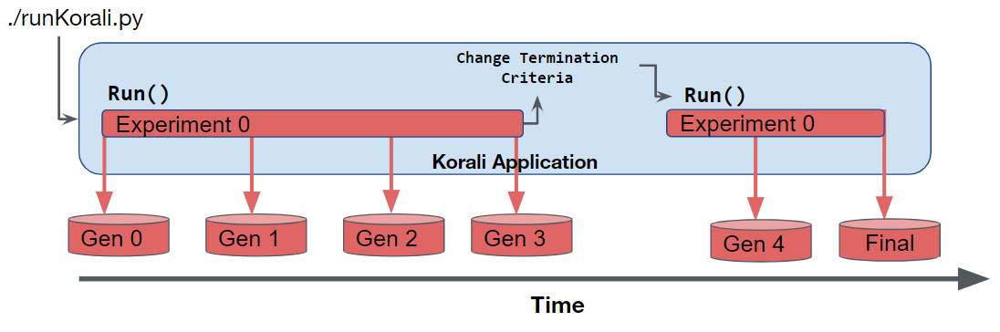
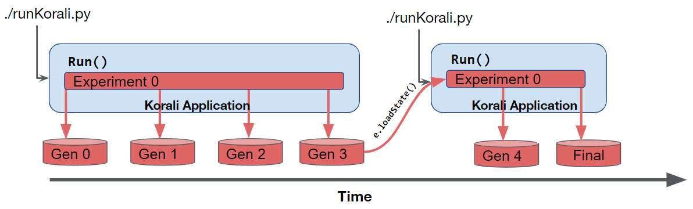

.. _checkpoints:

*********************************
Checkpoint / Resume
*********************************

Korali experiments can either run to completion or in part. In the latter case, the user can then operate over its partial results or change termination criteria and continue its execution later.
 
To ensure fault-tolerance for all experiments and systems, Korali also stores the entire state into its result files (checkpoints), regardless of the solver/problem/conduit modules selected. Execution can be later resumed from any of its result files without loss of information. 

Below, we discuss three possible use case scenarios for Korali's checkpoint/resume capability.

Running an experiment partially
------------------------------------------------

In this scenario, we have a Korali application which runs a stochastic optimization problem (using CMAES) for a few generations, checks partial results, and then continues with the rest of the generations.   

   
To do this, we simply define an initial set of termination criteria, and run the experiment:

.. code-block:: python

   import korali
   
   # Starting Engine
   k = korali.Engine()
      
   # Configuring experiment
   e = korali.Experiment()
   e["Problem"]["Type"] = "Optimization/Stochastic"
   e["Problem"]["Objective Function"] = myModel
   e["Solver"]["Type"] = "CMAES"
   
   # ...  More experiment configuration ...

   # Limiting maximum number of generations to 3   
   e["Solver"]["Termination Criteria"]["Max Generation"] = 3
   
   # Running 3 generations
   k.run(e)
   
   # Evaluating a domain-specific criterion as to whether to continue or not
   continue = check(e["Results"]["Best Sample"]) 

   if (continue):
    # Extending max generation number
    e["Solver"]["Termination Criteria"]["Max Generation"] = 100
    
    # Running again, starting from generation 4.
    k.run(e)

For a working example of this scenario, check this :ref:`tutorial <partialruns>`.

Resuming an experiment from a save-state file
------------------------------------------------

In this scenario, we continue the execution of an unfinished experiment which had started prior to the execution of the current application and saved checkpoints of its progress.
   

This use case is common in large-scale executions when a model evaluation error may occur, or simply a an allocation job has run out of allocated time.

To load the state an unfinished experiment, we use the :code:`e.loadState()` function.

To do this, we simply define an initial set of termination criteria, and run the experiment:

.. code-block:: python

   import korali
   
   # Starting Engine
   k = korali.Engine()
      
   # Creating experiment
   e = korali.Experiment()

   # Setting the path from which to load checkpoints and to write new ones
   e["File Output"]["Path"] = "resultsPath"
   
   # Loading previous results, if they exist.
   found = e.loadState()

   # Important: Re-specify model functions, because they are not stored in checkpoints
   e["Problem"]["Objective Function"] = myModel

   # If found, we continue execution 
   if (found == True):
   k.run(e)

For a working example of this scenario, check this :ref:`tutorial <checkpointrestart>`.
   
Resuming multiple experiments simultaneously
------------------------------------------------

In this scenario, we continue the execution of multiple unfinished experiments which had started prior to the execution of the current application and saved checkpoints of their progress.
 
.. image:: images/checkpoint_multiple.png
   :height: 200
   :align: center
   
This use case is common in large-scale executions when a model evaluation error may occur, or simply a an allocation job has run out of allocated time.

In this case, we use the :code:`e.loadState()` function for all experiments.

.. code-block:: python

   import korali 
   
   # Starting Engine
   k = korali.Engine()
      
   # Creating experiments
   e0 = korali.Experiment()
   e1 = korali.Experiment()
   
   # Setting the path from which to load checkpoints and to write new ones
   e0["File Output"]["Path"] = "resultsPath0"
   e1["File Output"]["Path"] = "resultsPath1"
   
   # Loading previous results, if they exist.
   e0.loadState()
   e1.loadState()

   # Important: Re-specify model functions, because they are not stored in checkpoints
   e0["Problem"]["Objective Function"] = myModel0
   e1["Problem"]["Objective Function"] = myModel1

   # If found, we continue execution 
   k.run([e0, e1])

For a working example of this scenario, check this :ref:`tutorial <checkpointrestart>`.