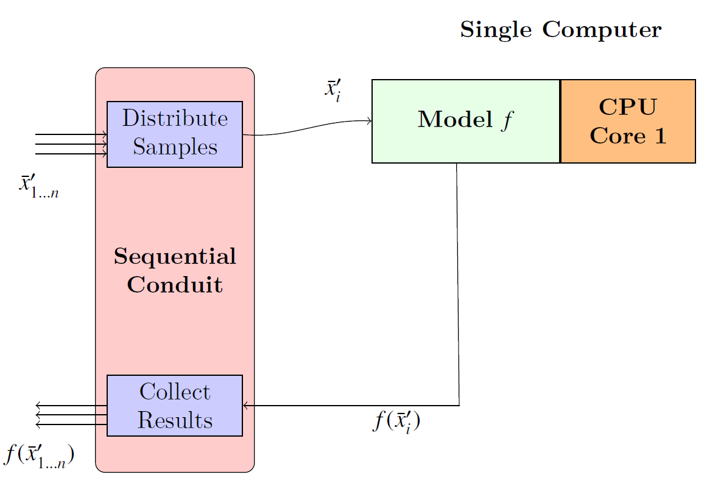
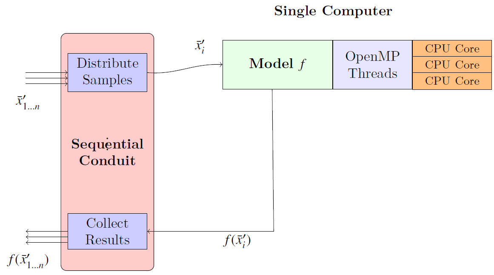
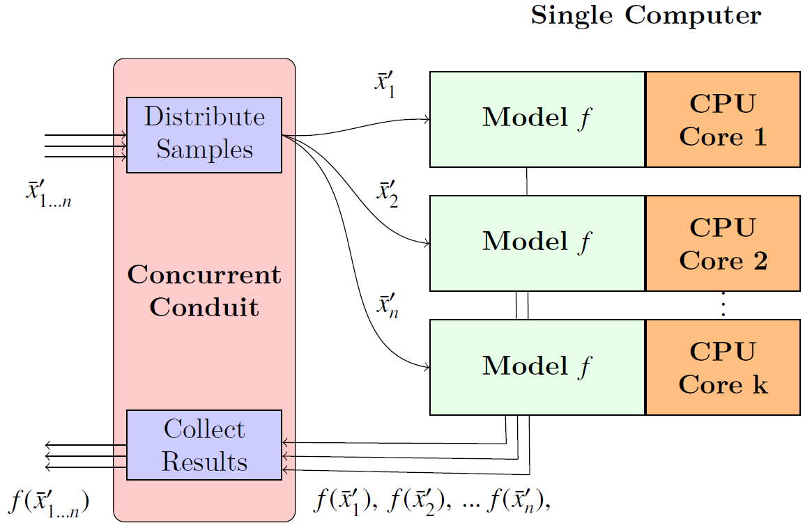
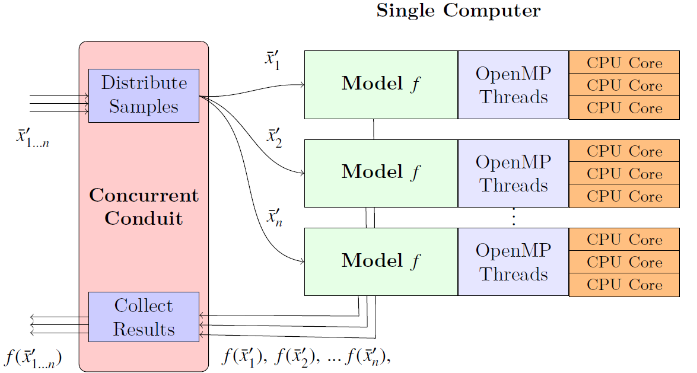
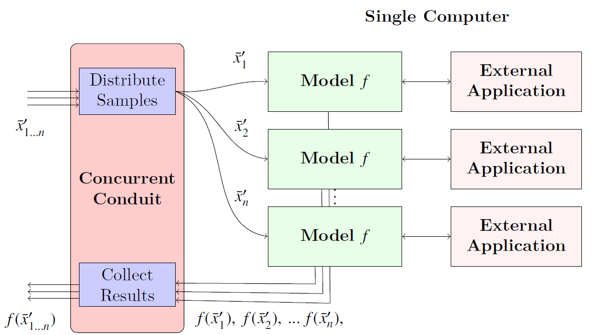
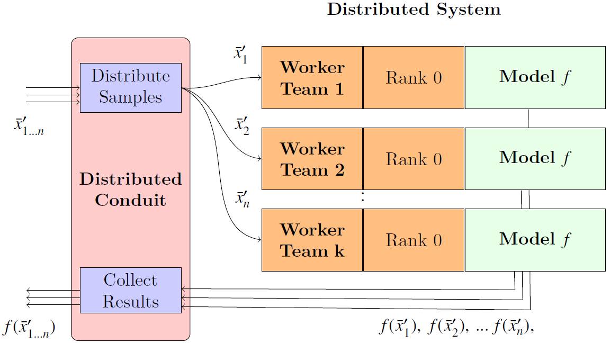
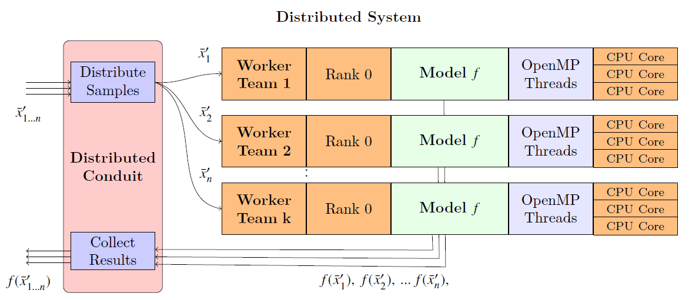
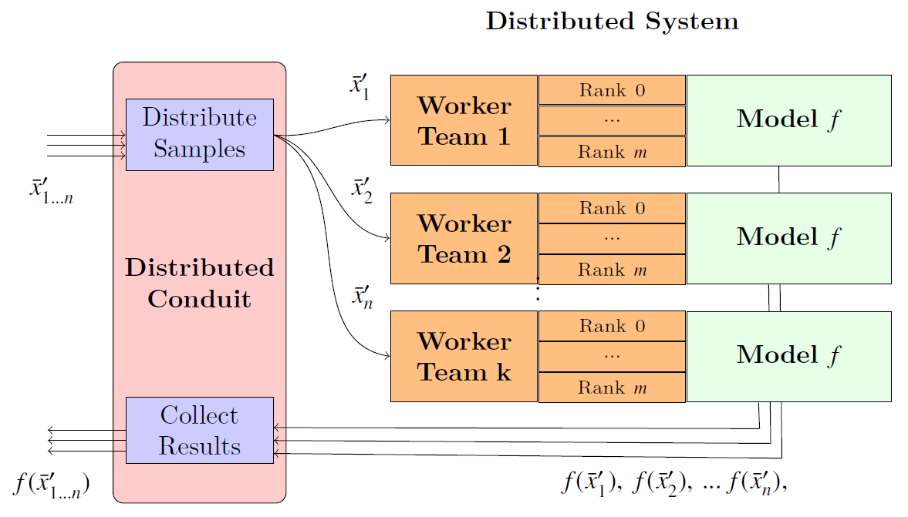
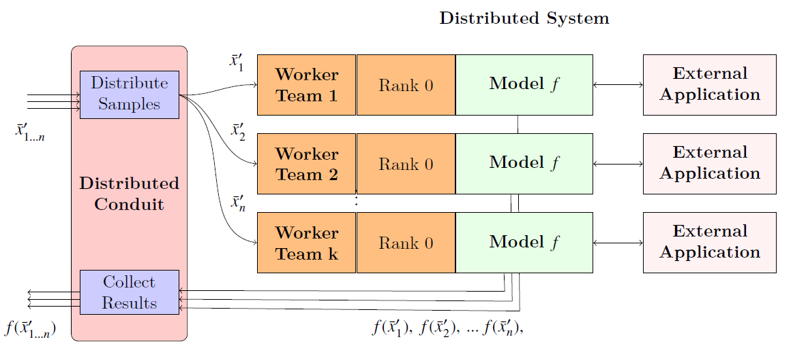
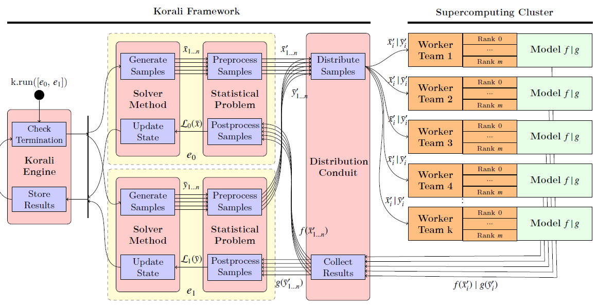

.. _parallel-execution:

*********************************
Parallel / Distributed Execution
*********************************

The Korali engine is tailor-made for execution in parallel and distributed systems, especially large-scale supercomputers.

Since the possible array of particular needs and systems can be diverse, Korali exposes multiple :ref:`Execution Conduits <module-conduit>`. An execution conduit handles the distribution of sample evaluations from/to the parallel system. Each conduit provides its own set of advantages and has its own set of configuration settings.

The conduit is a property of the Korali engine, which means that all experiments that a given engine runs will use the same parallelism strategy.

In this document, we discuss different parallelism/distributed execution scenarios and show which conduit fits better for the case.    

Sequential Execution (No parallelism)
======================================

The default behavior for Korali is to use the :ref:`Sequential Conduit <module-conduit-sequential>` conduit, which runs a single sample evaluation at any given moment using a single CPU core.

It is not necessary to specify any additional configuration for the sequential conduit to run.

This scenario assumes that the model function is also sequential. 

Local Parallelism
=================================

Sequential Sampling - Parallel Model
--------------------------------------

This scenario is similar to the one above, except that the model function uses parallelism to compute.

In this case, the model function may be using threads (e.g., OpenMP, Pthreads), or multi-processing (Fork/Join). This setup is perfectly compatible with Korali.

Parallel Sampling - Sequential Model
--------------------------------------

In this scenario, we use local parallelism (single computer) to run many simultaneous instances of a sequential model.

To enable this, we use the :ref:`Concurrent Conduit <module-conduit-concurrent>`, which uses multi-processing (Fork-Join model) to create many instances of the Korali process: one for the main engine, and the others for workers whose only task is to evaluate samples and return their results.

.. code-block:: python

   k["Conduit"]["Type"] = "Concurrent"
   k["Conduit"]["Concurrent Jobs"] = 16
   
In this case, Korali will create 16 worker processes (see: concurrent jobs setting), using 16 CPU nodes to run the model.

Parallel Sampling - Parallel Model
--------------------------------------

In this scenario, we use local parallelism (single computer) to run many simultaneous instances of a parallel model.

   
This scenario is similar to the one above, except that the model function uses parallelism to compute. In this case, the user needs to be careful not to oversubscribe the CPU with too many threads/processes.

In this case, we recommend to maximize sample-based parallelism, specifying as many concurrent jobs as possible, as opposed to the model's threads per execution.

Parallel Sampling - Pre-Compiled Model
-----------------------------------------

The :ref:`Concurrent Conduit <module-conduit-concurrent>` allows for the parallel execution of pre-compiled/binary files/legacy codes.

Distributed Parallelism
=================================

Here we discuss scenarios were parallelism extends to multiple computers using distributed computing models.

Distributed Sampling - Sequential Model
------------------------------------------

In this scenario, we use distributed parallelism (many computers) to run many simultaneous instances of a sequential model.

To enable this, we use the :ref:`Distributed Conduit <module-conduit-distributed>`, which uses MPI as communication backend to create many instances of Korali workers distributed among the system.

The following code snippet shows how to set the distributed conduit to run a sequential model:
  
.. code-block:: python

   k["Conduit"]["Type"] = "Distributed"
   k["Conduit"]["Ranks Per Team"] = 1

And run it using :code:`mpirun` or similar launch command, for example:

.. code-block:: bash

   mpirun -n 257 ./myKoraliExperiment.py
   
This example will run 256 Korali worker teams (257 - 1 for the main Korali engine), each one running the model function using a single process to compute.

Distributed Sampling - Parallel Model
------------------------------------------
   
This scenario is similar to the one above, except that the model function uses thread-parallelism (e.g., OpenMP) or GPUs (e.g, via CUDA) to compute.

In this case, it is recommended that the user runs one Korali worker per node/NUMA domain, and then the model function uses threading to employ all the cores/GPU therein.
   
.. code-block:: python

   k["Conduit"]["Type"] = "Distributed"
   k["Conduit"]["Ranks Per Team"] = 1

And run it using :code:`mpirun` or similar launch command, for example:

.. code-block:: bash

   mpirun -n 17 --ranks-per-node=1 ./myKoraliExperiment.py
      
Where the run will employ 17 nodes, one for the engine, and 16 for the workers.
 
Distributed Sampling - Distributed (MPI) Model
-----------------------------------------------
   
This scenario is similar to the one above, except that the model function uses MPI as distributed parallelism library. 

   
This is the general case for the :ref:`Distributed Conduit <module-conduit-distributed>`, in which worker teams can contains more than one rank. For example,
   
.. code-block:: python

   k["Conduit"]["Type"] = "Distributed"
   k["Conduit"]["Ranks Per Team"] = 4

The model function should expect an MPI Communicator object and operate upon it as in the following example:

.. code-block:: python

  def myMPIModel(sample): 
   MPIComm = sample["MPI Communicator"]
   rank = MPIComm.Get_rank()
   size = MPIComm.Get_size()
  
   x = sample["Variables"]["X"]
   q = compute_and_communicate(x)
  
   sample["F(x)"] = MPIComm.Reduce(q, MPIComm)
 

And run it using :code:`mpirun` or similar launch command, for example:

.. code-block:: bash

   mpirun -n 257 ./myKoraliExperiment.py
      
Where the run will employ 257 cores, one for the engine. With the reamining 256 ranks, it will create 64 worker teams of 4 ranks each.
 
Distributed Sampling - External Application
--------------------------------------------------

This is the case in which we run an external application in a distributed system.

Distributed Multi-Experiment Runs
=======================================

Korali conduits are capable of running multiple, independent experiments simultaneously. Furthermore, these experiments neet not be similar in their configuration, as they can specify diverse problem types and solver methods. The purpose for enabling multi-experiment runs is to increase the pool of pending samples, maximizing the occupation of Korali workers.

   
Obtaining Profiling Information
=======================================

The Korali engine can be configured to store profiling information that allows the post-mortem reconstruction of the execution timelines for each worker. This allows users to measure the efficiency of their parallelism strategy.

To enable profiling information, use this syntax:

.. code-block:: python

  k["Enable Profiling"] = True
  
Visit Korali's :ref:`profiler tool <profiler-tool>` documentation page for details on how to visualize profiling information.

