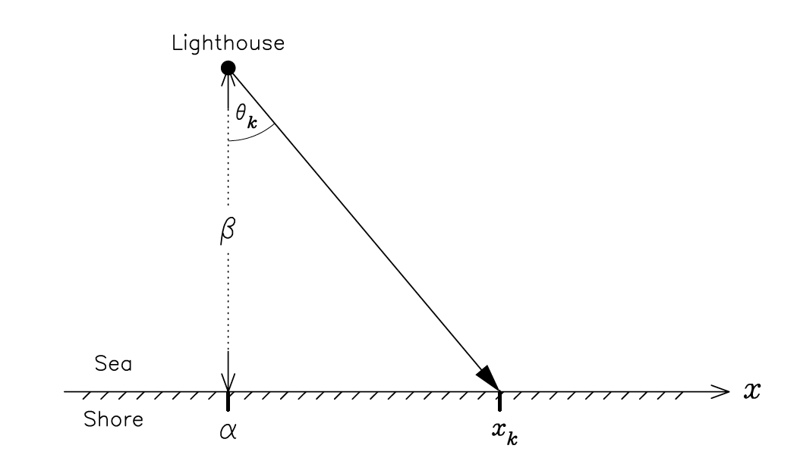

The Lighthouse Problem
================================================================================= 

The Lighthouse Problem 
                                                                        
A lighthouse is somewhere off a piece of straight coastline at a position  :math:`\alpha` along the shore and a distance :math:`\beta` out at sea. It emits a series of short highly collimate    d flashes at random intervals and hence at random azimuths. These pulses are intercepted on the coast by photo-detectors that record only the fact that a flash has occurred, but not the angl    e from which it came. :math:`N` flashes have so far been recorded at positions :math:`\x_k`. Where is the lighthouse? - Text taken from [Sivia2006] (Example 3, 2nd Edition).
                                                                           

                                                                              
References                                                                   
                                                                         
   [Gull1988] - Bayesian Inductive Inference And Maximum Entropy, Stephen F. Gull
   [Sivia2006] - Data Analysis, A Bayesian Tutorial, Oxford University Press, D. Sivia, J. Skilling

Setup                                                                           
----------------------------                                                    

Example 1 (distance :math:`\beta` from shore known, location :math:`\alpha` at coastline unknown)
   
.. code-block:: bash                                                            

  ./example_1
  python -m korali.plotter --dir _results_example_1                             
                                                                                 
Example 2 (distance :math:`\beta` & location :math:`\alpha` unknown)            
                                                                                 
.. code-block:: bash                                                            

  ./example_2
  python -m korali.plotter --dir _results_example_2                             
