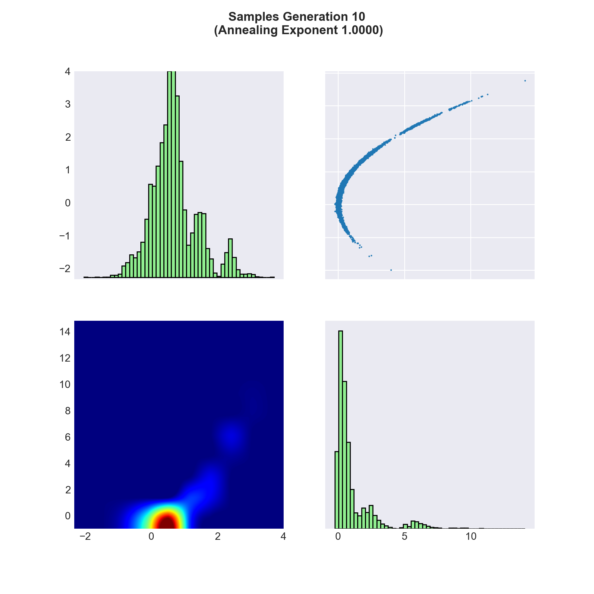
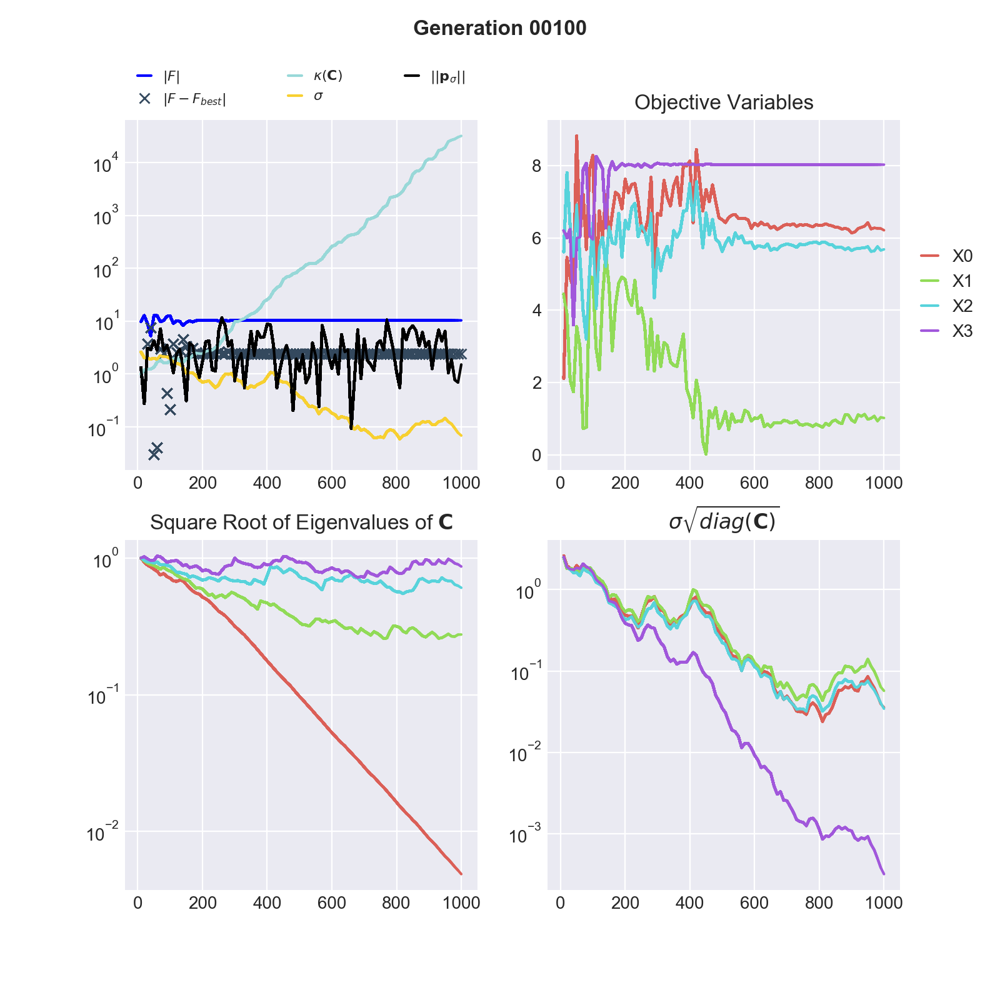

.. _korali-plotter:

*************************************
Korali Plotter
*************************************

Usage
========================

Syntax: :code:`python3 -m korali.plotter [--dir=RESULTS_DIR] [--test]`

Where:

  - :code:`--dir` specifies the source path of Korali results to plot. By default: :code:`_korali_result/`
  - :code:`--test` verifies that the plotter works, without plotting to screen.

Examples
========================

Plotting TMCMC
-----------------

Here we explain technical details of the :ref:`TMCMC <module-solver-sampler-tmcmc>` result plot.

The :code:`python3 -m korali.plotter` command plots the distribution of the samples at every generation. The samples are read from the json-files stored in the output directory (:code:`/_korali_result/`).

A plot of the samples obtained after the final generation of TMCMC function is given below. Here, the target function is the exponential of the negative of the 2-dimensional `Rosenbrock <https://en.wikipedia.org/wiki/Rosenbrock_function>`_ function.

**Diagonal Plots**. The diagonal plots show the marginal probability densities of the samples for each variable. Note that the indices of the vertical axes correspond to the upper and lower triangle plot and not to the diagonal plots.
**Upper Triangle**. In the plots in the upper triangle we see the actual realization of the samples. The axes represent the dimensions, respectively the objective variables, of the problem and we show a two-dimensional plot for every variable pair.
**Lower Triangle**. The lower triangle shows the probability density of the samples for each variable pair. The density is approximated through a smoothening operator applied to the number of samples that can be found in a given area.

Plotting CMAES
--------------------------------------------

Here we explain :ref:`CMAES <module-solver-optimizer-cmaes>` result plot in further detail and how it can be
used to validate your optimization.

The module korali.plotter (run with :code:`python3 -m korali.plotter`) command visualizes some of the most meaningful states of CMA-ES stored in the result files in the output directory (:code:`_korali_result`). To plot a running simulation use the command :code:`python3 -m korali.plotter --live` for incremental plots.

In the figure below we see the evolution of the CMA-ES algorithm during 100 optimization steps, respectively 1000 function evaluations (here the sample size is 10), of the negative 2-dimensional `Rosenbrock <https://en.wikipedia.org/wiki/Rosenbrock_function>`_ function.

.. image:: optimizing_rosenbrock.png

**Quadrant 1**: The first quadrant (upper left) shows 4 graphs plus markers (crosses):

* :math:`| F |$ (red): :math:`F` is the best function evaluation of the current generation. Note that the colour of :math:`F` changes if :math:`F < 0` (red) or :math:`F \geq 0` (blue). Also, the absolute value of F is plotted since the vertical axis is given in log-scale.
* :math:`\kappa(\mathbf{C})` (cyan): This line shows the condition of the covariance matrix of the proposal distribution at every generation. The condition is given by the ratio of the largest Eigenvalue to the smallest Eigenvalue. A large condition number may lead to numerical instabilities, this can be treated by normalizing the domain of the objective variables.
* :math:`|| \mathbf{p}_{\sigma} ||` (black):  The evolution path is a measure of the travel direction of the mean of the proposal distribution of CMA-ES. The Euclidean norm of the evolution path plays an important rule in the Sigma updating rule.
* :math:`\sigma$ (yellow) : :math:`\sigma` is the scaling parameter of the covariance matrix. The scaling parameter is updated at every generation. If Sigma becomes very large or small it may have an adverse effect on the optimization.
* :math:`| F - F_{best}|` (crosses) : At every generation we calculate the absolute difference betwen the current best function evaluation (:math:`F`) and the overall best found evaluation (:math:`F_{best}`) of CMA-ES. The crosses appear only if the current generation does not impeove the overall result, i.e. :math:`F < F_{best}`   in current generation and :math:`| F - F_{best} |` is greater 0.

A good indicator of convergance of CMA-ES to the global maximum is given by a steady decrease of :math:`| F - F_{best} |`.

**Quadrant 2**: Objective Variables: This plot shows the evolution of the objective variables corresponding to the evaluation of :math:`|F|`. A line per each dimension of the optimization problem is plotted.
**Quadrant 3**: Square Root of Eigenvalues :math:`\mathbf{C}`: The square root of the Eigenvalues of :math:`\mathbf{C}` are the lengths of the axes of the (unscaled) covariance matrix. Optimally the lengths of the axes are of same magnitude.
**Quadrant 4**: :math:`\sigma \sqrt{diag(\mathbf{C})}`: the square root of the diagonal elements of the (scaled) covariance matrix of the proposal distribution approximate the standard deviation of the parameters. Ideally the standard deviations of all coordinates are of same magnitude.

**Example: Shekel function**

The following figure shows the results of an unsuccessful maximization of the
negative of the `Shekel <https://en.wikipedia.org/wiki/Shekel_function>`_ function in 4 dimensions and with 10 local maxima.

`We know <http://www-optima.amp.i.kyoto-u.ac.jp/member/student/hedar/Hedar_files/TestGO_files/Page2354.htm>`_ that the Shekel function has a global minimum at (4, 4, 4, 4),
respectivel maximum in the negative case. In quadrant 2 we see that CMA-ES converged to a different result.

In general the global optimum is not known, following observations indicate
ill convergence. Restarting CMA-ES from different starting points as well as
tuning CMA-ES internal parameters might improve optimization:

* Increasing condition (quadrant 1) of the covariance matrix of the proposal distribution, respectively diverging axes lenghts and standard deviations (quadrants 3 & 4).
* None decreasing values for :math:`| F - F_{best} |`. Arguably CMA-ES found a better function evaluation on a different hill but the algorithm is trapped (the objective variables stabilized sampling does not overcome the saddle points).
